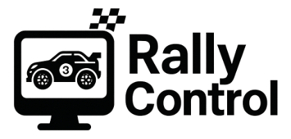

# 🏁 RallyControl

Web-basierte Zeiterfassung und Rennverwaltung für RC-Rally-Rennen

RallyControl ist eine modulare, Python-basierte Software zur präzisen Zeitmessung, Fahrer- und Rennverwaltung im RC-Car Rally-Bereich.
Das System kombiniert Lichtschranken-basierte Zeitmessung mit kameragestützter Startnummernerkennung und stellt alle Daten in einem Live-Web-Dashboard sowie einer Zuschauer-Kiosk-Ansicht bereit.

RallyControl wurde für den praxisnahen Einsatz auf Rally-Stages, Parcours und Trainingsstrecken entwickelt – robust, WLAN-basiert und erweiterbar.

## ✨ Hauptfunktionen
### 🚗 Fahrer- & Fahrzeugverwaltung
- Zentrale Verwaltung von Fahrern, Startnummern, Teams und Klassen
- Aktivierung/Deaktivierung pro Lauf oder Stage
- Klare Zuordnung von Zeiten zu Fahrern

### ⏱️ Präzise Zeiterfassung
- Lichtschranken an Start-, Ziel- und Zwischen-Toren
- Exakte Zeitstempel direkt am Gate (Edge-Device)
- Unterstützung für Stages, Heats und Training

### 📸 Startnummernerkennung
- RaspiCam erfasst bei jeder Durchfahrt ein Bild
- Automatische Ermittlung der Startnummer
- Fallback auf manuelle Korrektur im Dashboard

### 📊 Live-Dashboard
- Übersicht aller aktiven Läufe
- Aktuelle Zwischenzeiten und Bestzeiten
- Automatische Rangliste nach konfigurierbaren Regeln
- Manuelle Korrekturen (DNF, DSQ, Strafzeiten)

### 📺 Kiosk-Webseite für Zuschauer
- Vollbild-Ansicht für Monitor oder TV
- Live-Rangliste und laufende Fahrer
- Keine Anmeldung erforderlich
- Optimiert für Kiosk-Modus im Browser

## 🧩 Systemarchitektur (Kurzüberblick)
### Gate-Einheiten (Start / Ziel / Checkpoint)
- Raspberry Pi (oder kompatibel)
- Lichtschranke für exakte Zeitmessung
- RaspiCam zur Bilderfassung
- WLAN-Anbindung an den Server
- Ereignisbasierte Übertragung (Gate → Server)

### Zentraler Server
- Python-Webserver (z. B. Flask oder FastAPI)
- Datenbankgestützte Speicherung aller Rennen
- Echtzeit-Updates via WebSocket / SSE
- Web-Frontend für Admins & Zuschauer

## 🧠 Typische Anwendungsfälle
- RC-Rally-Zeitfahren
- Trainings- und Testläufe
- Club-Rennen mit Live-Anzeige
- Mobile Strecken mit WLAN-Gates
- Schulungs- und Demo-Events

## 🚧 Projektstatus
⚠️ Work in Progress
RallyControl befindet sich in aktiver Entwicklung. Ziel ist ein stabiles, modulares System, das sowohl für Hobby-Rennen als auch für strukturierte Events geeignet ist.

## 🗺️ Geplante Erweiterungen
- Mehrere Klassen & Regelwerke
- Strafzeiten & Penalty-System
- Export (CSV / JSON / PDF)
- Offline-Pufferung an den Gates
- Benutzer- & Rollenverwaltung
- REST-API für externe Anzeigen

## Development Quickstart (Django Admin + Stammdaten)
- Prereqs: Python 3.11+ (entwickelt mit 3.13).
- Setup: `python -m venv .venv && .\.venv\Scripts\Activate.ps1 && pip install -r requirements.txt`
- Datenbank: `python manage.py migrate` (SQLite per Default).
- Benutzer: `python manage.py createsuperuser` (Custom User mit Rollen `admin`, `operator`, `viewer`).
- Starten: `python manage.py runserver` und im Browser auf `http://localhost:8000` (Dashboard/Landing) bzw. `/admin/` (Django Admin).
- Stammdaten: Fahrer, Fahrzeuge, Klassen, Events, Stages, Sessions und Gates k�nnen �ber das Dashboard (UI) oder den Admin gepflegt werden.
